# TrafficIQ - Supply Chain Transport Intelligence

An AI-powered supply chain transport intelligence platform with a **multi-agent architecture** — 6 specialist AI agents with **56 tools** connecting **D365 Warehouse Management**, **Azure IoT Hub fleet telemetry**, and **real-time traffic intelligence** to optimize goods delivery routes. Built with **Microsoft Foundry Agent Service**, **D365 F&O MCP**, **Azure Maps**, and **Azure IoT Hub**.

Features **weather overlays**, **POI search along routes**, **marker clustering**, **truck vs car route comparison**, **isochrone (reachable range) analysis**, **GPS snap-to-road correction**, and **interactive map controls** across all map views.

---

## Problem Statement

Supply chain logistics teams managing warehouse shipments and delivery routes lack real-time traffic intelligence integration. Dispatchers manually check traffic conditions, cannot dynamically re-optimize multi-stop delivery routes, and have no automated way to update ETAs when traffic incidents occur. Fleet vehicles operate without IoT telemetry or predictive maintenance, technician scheduling is manual, field service SLAs are tracked on spreadsheets, and inventory visibility across warehouses is fragmented. This leads to missed delivery windows, unplanned vehicle downtime, inefficient routing, and poor customer communication.

## Solution

TrafficIQ bridges the gap between **enterprise warehouse management (D365 F&O)**, **real-time traffic intelligence (Azure Maps)**, and **IoT fleet telemetry (Azure IoT Hub)** through a **multi-agent AI system**. The platform deploys 6 specialist AI agents — each with domain-specific tools — coordinated by a three-tier routing orchestrator:

- Query shipment status with live traffic impact analysis
- Optimize multi-stop delivery routes considering current traffic conditions
- Automatically update ETAs when delays are detected
- Track fleet vehicles in real time with GPS positioning via IoT Hub
- Monitor IoT device health, geofence alerts, and driving behavior
- Manage predictive maintenance and work orders
- Handle field service requests, SLAs, and technician dispatching
- Schedule technician assignments and optimize resource allocation
- Monitor inventory levels and returns processing
- Get AI-powered recommendations through natural language conversation

---

## Demo Video

▶️ **Watch the full demo** — see multi-agent routing, tool execution, auto-navigation, and the architecture in action.

<a href="https://youtu.be/puOLAEuKyEI">
  
</a>

🔗 [**Watch on YouTube →**](https://youtu.be/puOLAEuKyEI)

---

## Multi-Agent Architecture

TrafficIQ uses a **multi-agent orchestrator** with **6 specialist agents** and a Microsoft-style **golden path architecture**:

> 🔗 [**View Multi-Agent Flow Diagram (live)**](https://htmlpreview.github.io/?https://github.com/raghavmishrad365/TrafficIQ/blob/main/docs/trafficiq-flow.html)
<!-- Screenshot: trafficiq-multi-agent diagram rendered in browser -->
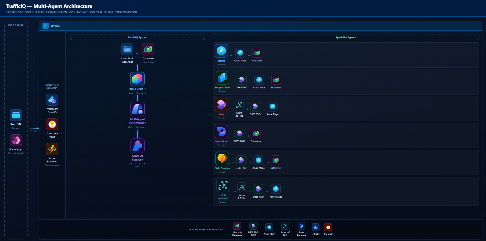
Architecture flow summary:
- The **Chat Panel** sends user input through **TRAFI** (AI identity) into the **MultiAgentOrchestrator**.
- The orchestrator applies 3-tier routing: `sticky → keyword match → RouterAgent (LLM)` to select one of 6 specialist agents.
- Each specialist agent calls **Azure AI Foundry** (GPT-4.1) via the Assistants API (agent / thread / run lifecycle).
- Agent tool calls hit real backend services: **Azure Maps**, **D365 F&O MCP Server**, **Azure IoT Hub**, **Microsoft Dataverse**, **Power Automate**.

Each agent has its own system prompt, tool set, and Foundry thread. The orchestrator handles context handoff when switching between agents, passing a summary of recent messages to maintain conversational continuity.

---

## Key Features

### Shipment Dashboard
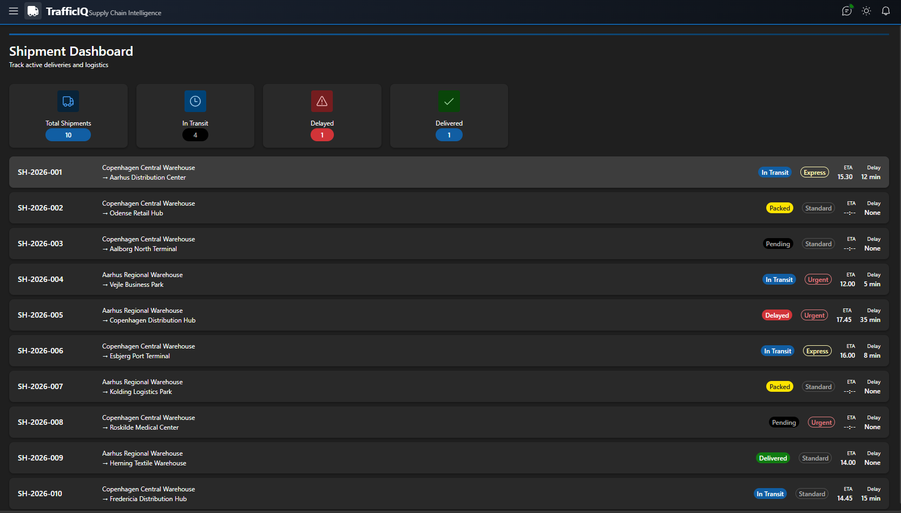
- Real-time view of all warehouse shipments with status tracking (pending, packed, in-transit, delivered, delayed)
- Traffic delay indicators per shipment
- Priority-based badge system (urgent, express, standard)
- Filter by warehouse and shipment status
- Clickable rows navigate directly to shipment tracking

### Shipment Tracking
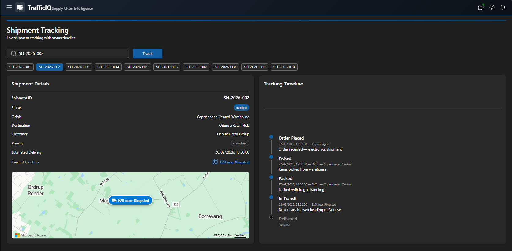
- Live GPS tracking of in-transit shipments
- Inline mini-map — click "Current Location" to reveal an interactive Azure Map showing the shipment's position with a truck marker
- Proof of delivery capture and verification
- ETA updates with traffic-aware calculations
- Auto-track when navigated from Shipment Dashboard or Analytics alerts

### Delivery Route Planner
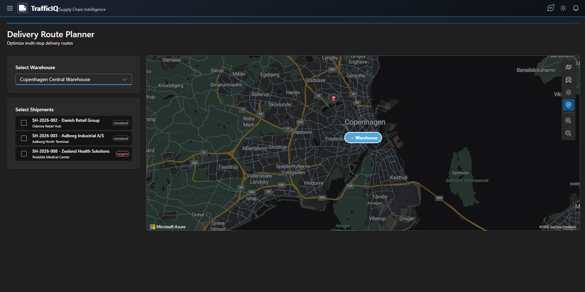
- Multi-stop delivery route optimization using Azure Maps waypoint optimization
- Select warehouse origin and pending shipments to include
- TSP-style route optimization with `computeBestOrder=true`
- Shows total distance, duration, and traffic delays for optimized plan
- Ordered stop list with customer and destination details
- Weather overlay and POI markers along the route
- Share optimized route via link

### Fleet Management
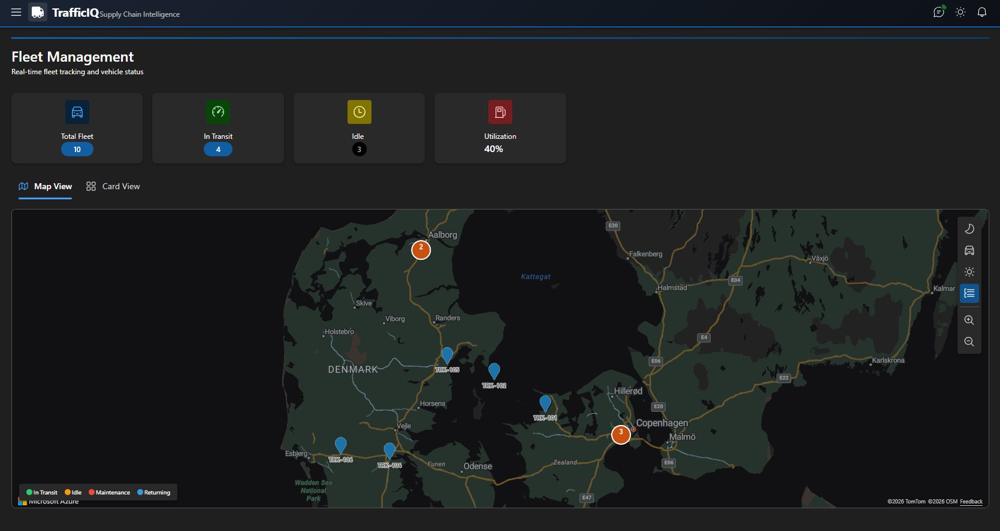
- Real-time fleet vehicle tracking on interactive map (FleetMap)
- SVG truck icon markers with status-colored badges
- Rich click popups: driver, speed, load, fuel, and direct links to shipment tracking and fleet details
- Vehicle status monitoring (in-transit, idle, maintenance, returning)
- Optional marker clustering for dense fleets
- Driver performance metrics and analytics

### Azure Maps Overlays & Controls
All map views (Dashboard, Fleet, Delivery Planner, Journey Planner) include a unified map control panel with:
- **Map style cycle** — Road / Satellite / Night (auto-follows app dark theme)
- **Traffic toggle** — Real-time traffic flow and incidents
- **Weather overlay** — Temperature, wind, precipitation badges at key locations
- **POI markers** — Gas stations, rest areas, truck stops, repair shops with click popups
- **Marker clustering** — Aggregate dense vehicle markers into count bubbles (Fleet map)
- **Zoom in/out** controls
- **Truck vs Car route comparison** — Side-by-side route overlay with time/distance delta
- **Reachable range (isochrone)** — Semi-transparent polygon showing how far a vehicle can travel in a given time/fuel budget

### Predictive Maintenance
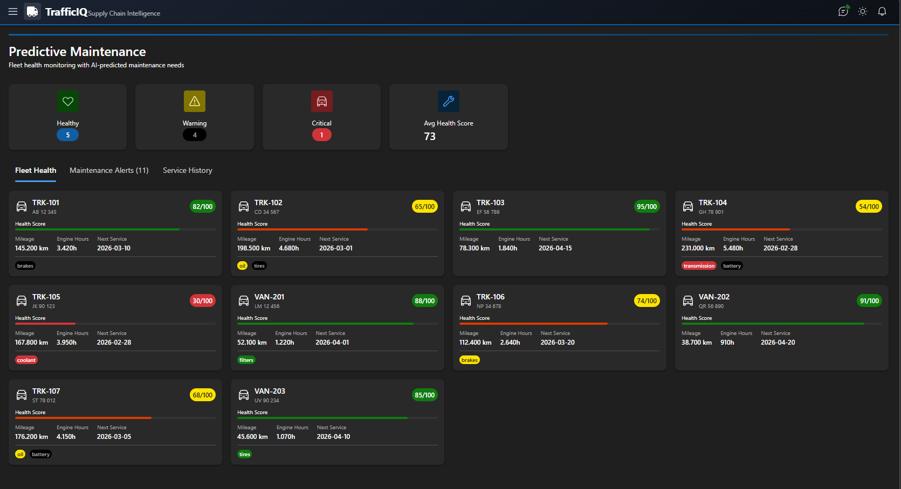
- Vehicle health scoring and condition monitoring
- Maintenance alert prioritization (critical, high, medium, low)
- Maintenance history tracking per vehicle
- Proactive service scheduling based on telemetry

### IoT Device Management
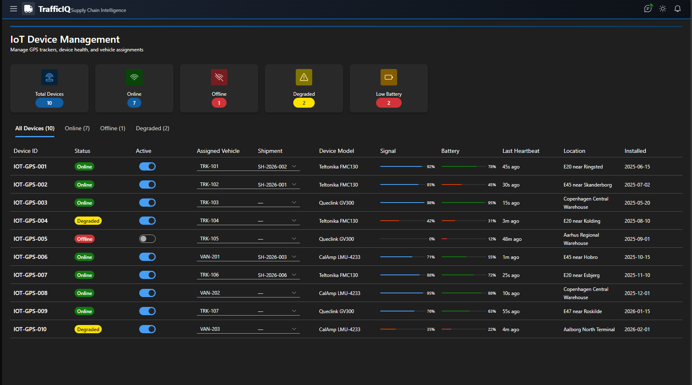
- Full device registry page at `/iot-devices` with all GPS trackers from Azure IoT Hub
- Summary cards: Total, Online, Offline, Degraded, Low Battery counts
- Activate/deactivate devices with toggle switch (updates status in real time)
- Assign devices to fleet vehicles via dropdown selector
- Auto-populated shipment column from assigned vehicle's active shipment
- Signal strength and battery level progress bars per device
- Relative heartbeat timestamps with full-date tooltips
- Tab filtering: All Devices / Online / Offline / Degraded
- Connects to Dataverse `tiq_iotdevices` table with mock data in demo mode
- Geofence alerts for warehouse zone entry/exit with dwell times
- Driving behavior alerts (speeding, harsh braking, excessive idling, route deviation)

### Field Service
- Service request management with customer assets and SLA tracking
- Technician dispatching with skill matching and proximity-based ETA
- Service visit completion with resolution notes and parts tracking
- Field parts inventory across vehicles and warehouses
- KPIs: first-fix rate, mean response time, SLA compliance

### Scheduling Board
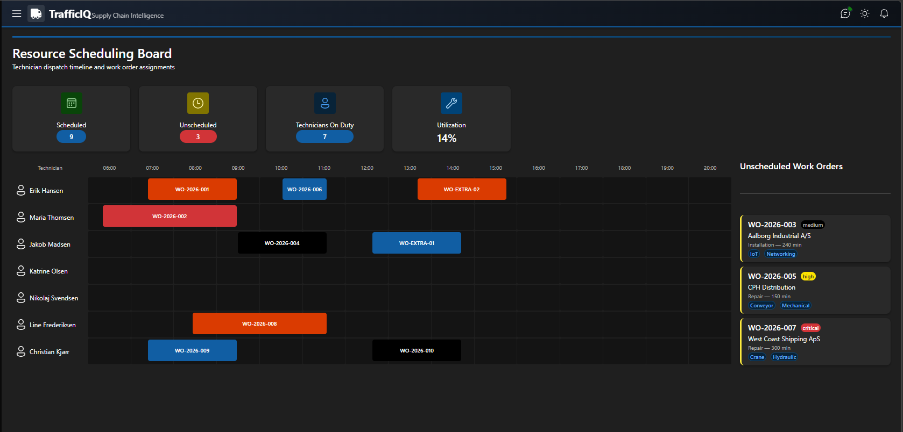
- Visual technician scheduling grid
- Work order assignment and optimization
- Technician availability tracking
- Drag-and-drop schedule management

### Work Orders
- Work order lifecycle management (open, in-progress, completed)
- Technician assignment with priority routing
- Parts and inventory integration

### Inventory Management
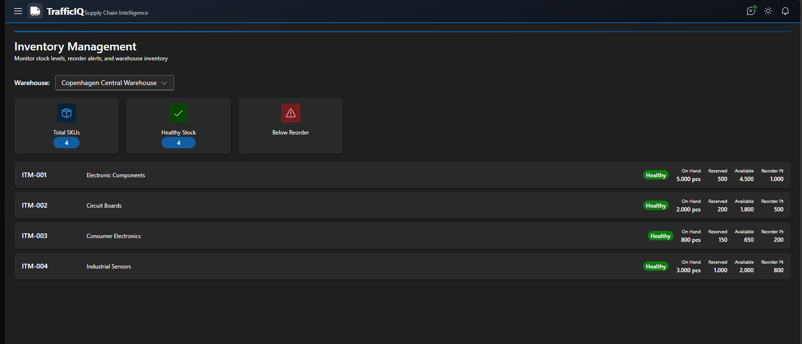
- Warehouse inventory levels with stock alerts
- Low stock and overstock threshold monitoring
- Multi-warehouse inventory comparison

### Returns Processing
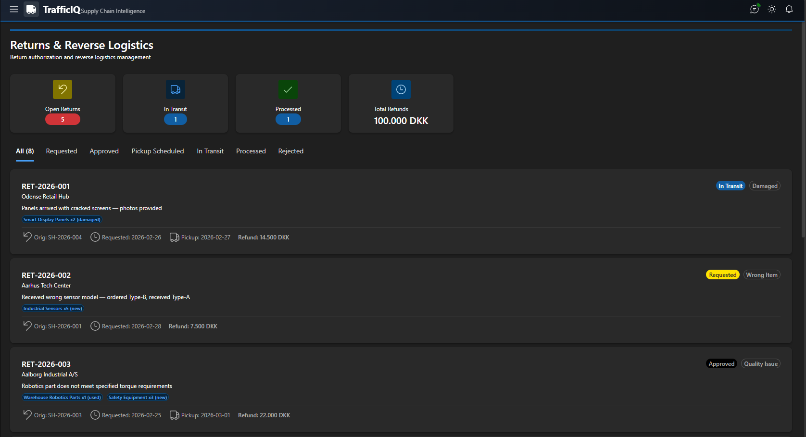
- Return request tracking and approval workflows
- Return status lifecycle management
- Reason-code categorization and analytics

### Analytics Dashboard
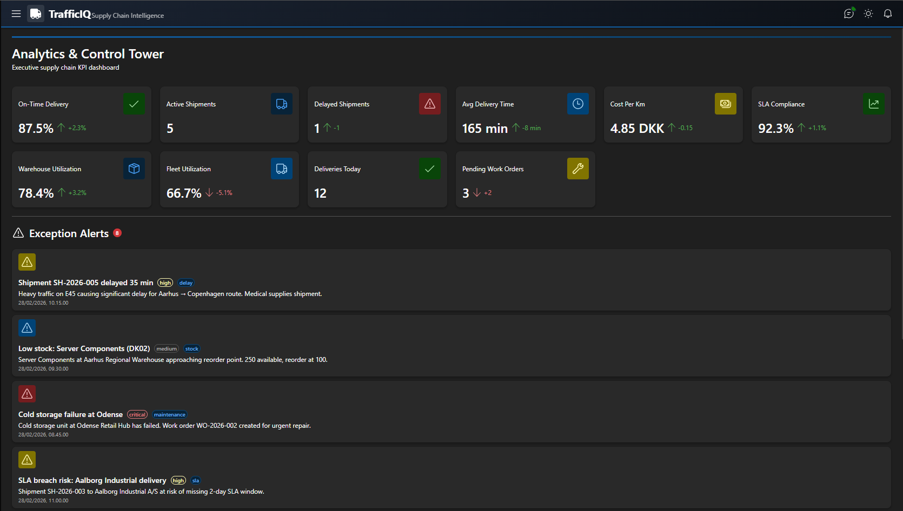
- Supply chain KPI visualization (on-time delivery, fleet utilization, SLA compliance, warehouse utilization, cost per km)
- Clickable KPI cards navigate to relevant pages (e.g. Fleet Utilization → Fleet, Pending Work Orders → Work Orders)
- Exception alerts with severity badges — clickable, routing to relevant pages based on alert type
- Performance trend indicators with directional arrows

### AI Multi-Agent Assistant (TRAFI)
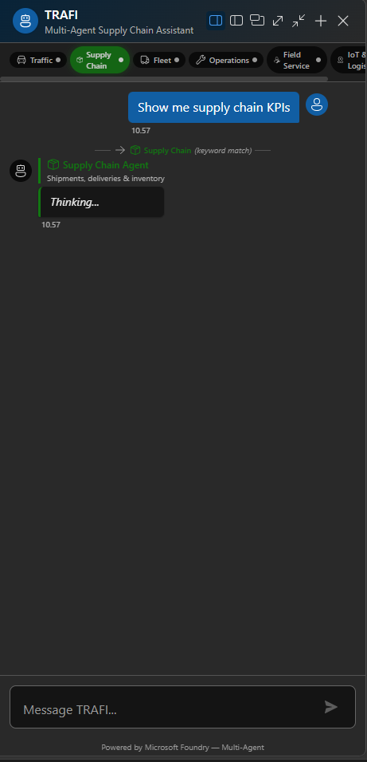
- Natural language conversational interface powered by Microsoft Foundry Agent Service
- **6 specialist agents** with **56 function-calling tools** across traffic, supply chain, fleet, operations, field service, and IoT logistics
- Three-tier routing: sticky → keyword → LLM classifier
- Bilingual support (Danish and English)
- Adaptive Card forms for structured data collection
- Thread-based conversation management with cross-agent context handoff
- Real-time tool execution indicators with agent badges

### Real-Time Traffic Intelligence
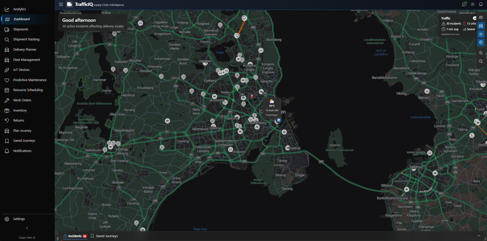
- Interactive Azure Maps display with live traffic conditions
- Corridor-based incident detection along delivery routes
- Traffic impact classification (clear, minor delays, major delays, blocked)
- Proactive re-routing suggestions when incidents are detected
- Weather overlay integration for route weather awareness
- POI search along routes (gas stations, rest areas, truck stops, repair shops)

### Commute Intelligence
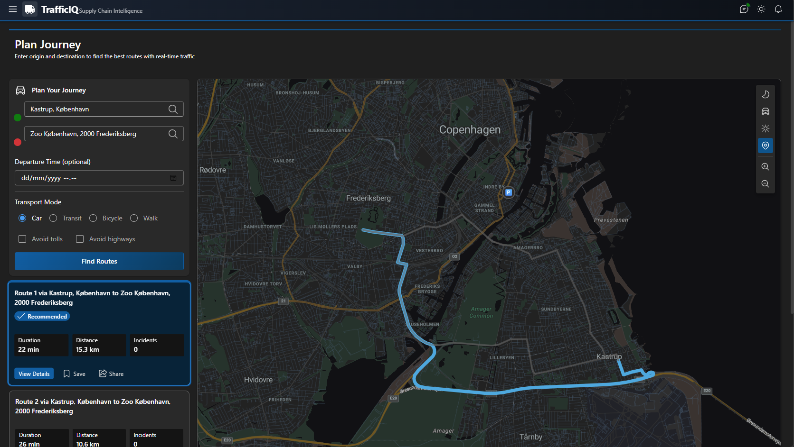
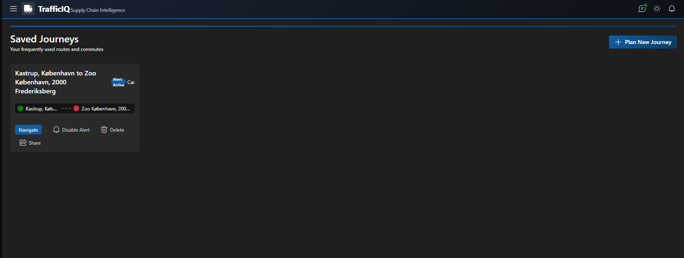
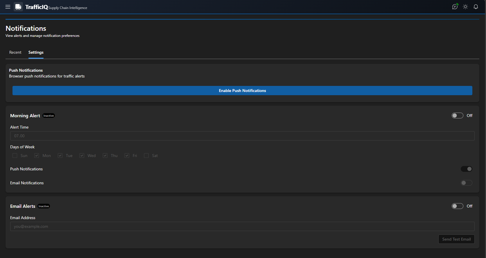
- Personal journey planning with route comparison
- Saved journey monitoring with morning commute alerts
- Historical route comparison against past trips
- Push and email notification support

### Dataverse Persistence (Dual-Write)
All application data is persisted to **Microsoft Dataverse** with a localStorage cache for fast reads:
- **20+ Dataverse tables** — shipments, warehouses, inventory, fleet vehicles, work orders, technicians, notifications, saved journeys, route options, maintenance alerts, return orders, IoT devices, geofence zones, supply chain KPIs, and more
- **Settings dual-write** — all 9 settings categories (demo mode, theme, map, D365, Dataverse, Dataverse MCP, email, IoT Hub, agents) sync to `tiq_appsettings` key-value table
- **Agent configuration sync** — per-domain agent settings (enabled, model, keywords, sort order) sync to `tiq_agentconfigurations`
- **Three connection modes** — Power Platform SDK (embedded in Power Apps), Dataverse REST proxy (local dev with OAuth2 client credentials), localStorage fallback (offline/demo)
- **Startup sync** — settings and agent configs are loaded from Dataverse on app start, merged into localStorage

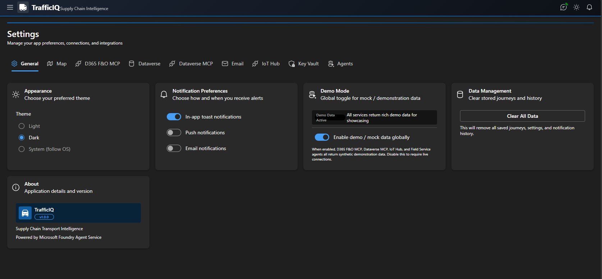
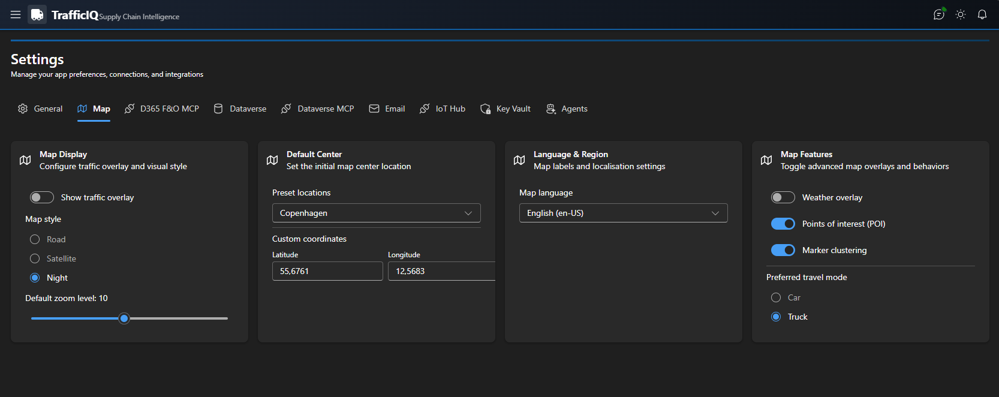
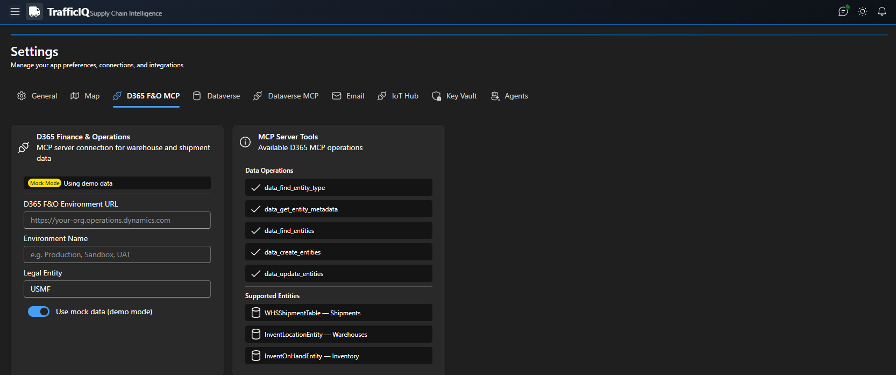
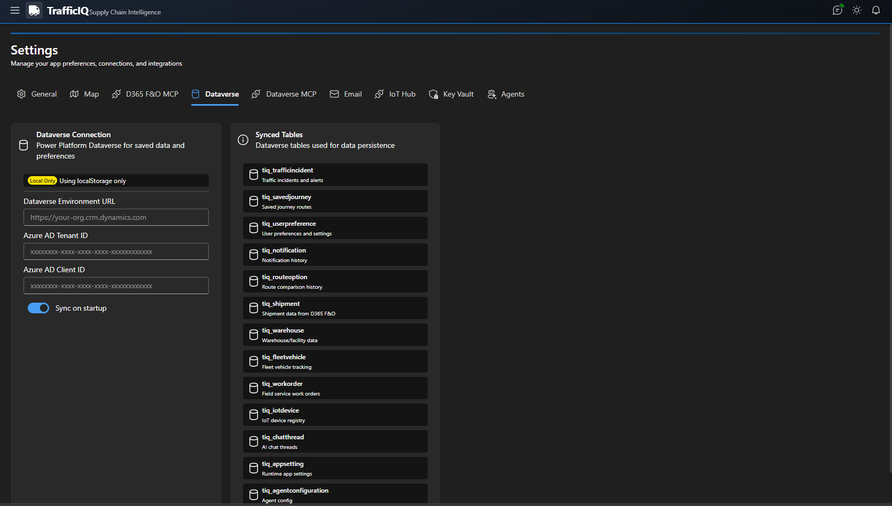
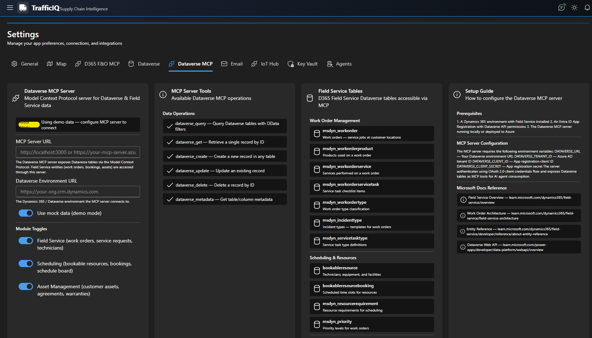
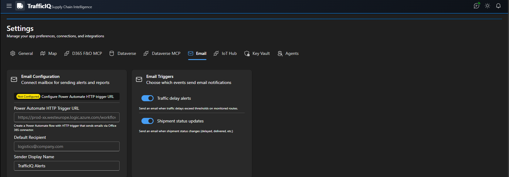
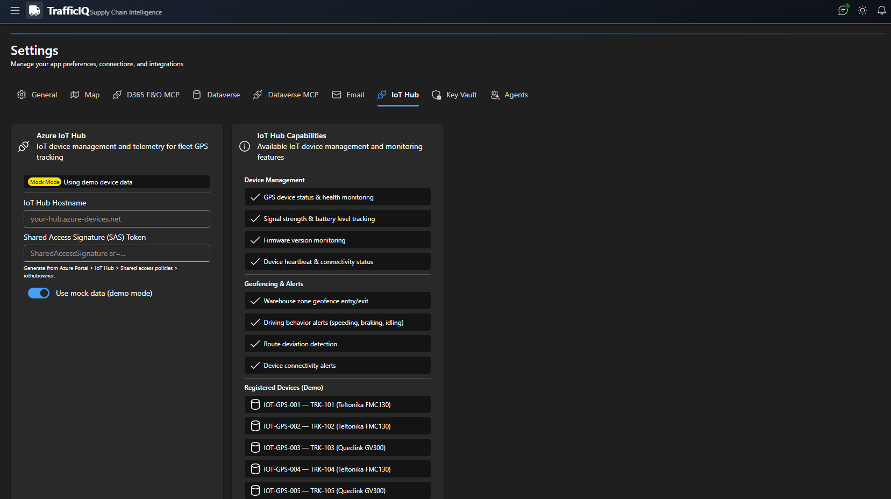
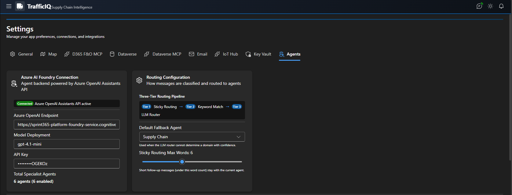
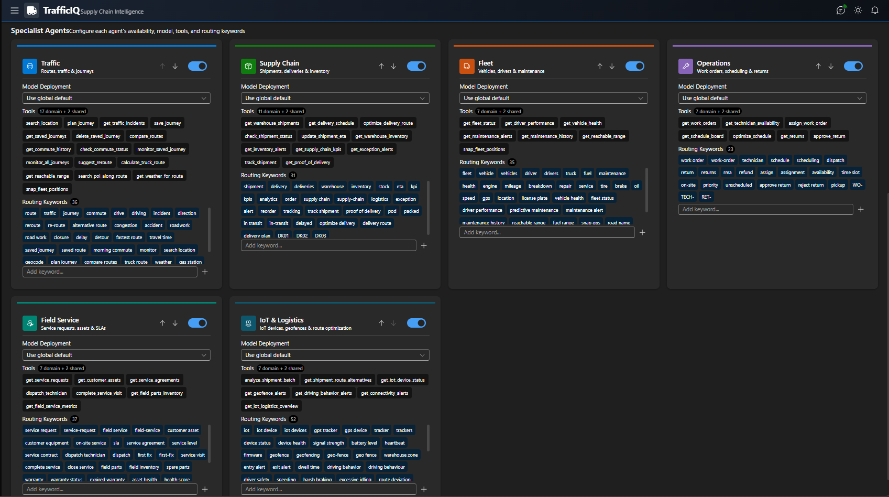

---

## Hero Technologies

| Technology | Usage |
|---|---|
| **Microsoft Foundry (Agent Service)** | Multi-agent system with 6 specialist agents via Foundry REST API (Assistants pattern: agents, threads, messages, runs) |
| **D365 F&O MCP Server** | CRUD operations on warehouse shipments, inventory, and delivery entities via `data_find_entities`, `data_update_entities` |
| **Azure Maps** | Real-time traffic incidents, route optimization, geocoding, multi-stop delivery planning, weather forecasts, POI search, truck routing, reachable range (isochrone), GPS snap-to-road |
| **Azure IoT Hub** | GPS device management, geofence monitoring, driving behavior telemetry, fleet connectivity tracking |
| **Azure AI Foundry** | GPT-4.1 + GPT-4.1-mini model deployments for agent reasoning |
| **Azure Key Vault** | Centralized secret management with Vite build-time injection |
| **Azure Static Web Apps** | Production hosting with built-in Azure Functions API |

---

## Tech Stack

| Layer | Technology |
|---|---|
| **Frontend** | React 19 + TypeScript 5.9 |
| **Build Tool** | Vite 7 |
| **UI Library** | Fluent UI React Components 9 |
| **Routing** | React Router DOM 6 |
| **Async State** | TanStack React Query 5 |
| **Maps** | Azure Maps Control 3.5 |
| **AI Agent** | Microsoft Foundry Agent Service REST API (Multi-Agent Orchestrator) |
| **ERP Integration** | D365 Finance & Operations MCP Server |
| **IoT Telemetry** | Azure IoT Hub (device twins, geofences, driving alerts) |
| **Traffic Data** | Azure Maps Traffic API, Weather API, POI Search API, Route Range API, Snap to Roads API |
| **Platform** | Microsoft Power Apps SDK |
| **Data Storage** | Microsoft Dataverse (dual-write) + localStorage fallback |
| **Notifications** | Web Push API (VAPID) + Power Automate |
| **Hosting** | Azure Static Web Apps (SPA + Azure Functions API) |
| **Secret Management** | Azure Key Vault |

---

## Architecture

> 🔗 [**View Architecture Diagram (live)**](https://htmlpreview.github.io/?https://github.com/raghavmishrad365/TrafficIQ/blob/main/docs/architecture-diagram.html)

<!-- Screenshot: Architecture diagram rendered in browser -->
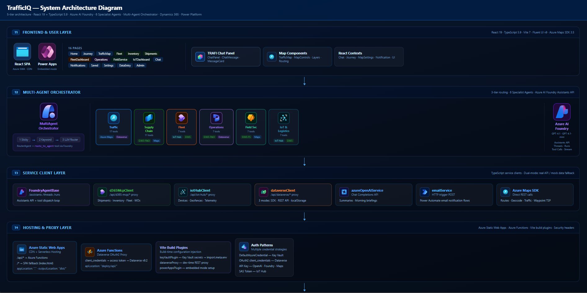
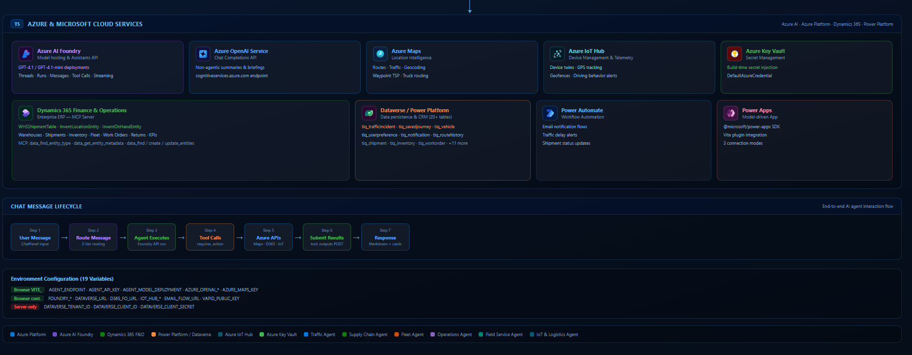

> Source: [`docs/architecture-diagram.html`](docs/architecture-diagram.html) — [**Open rendered page ↗**](https://htmlpreview.github.io/?https://github.com/raghavmishrad365/TrafficIQ/blob/main/docs/architecture-diagram.html)

---

## Pages & Navigation

| Route | Page | Description |
|---|---|---|
| `/` | Dashboard | Traffic overview map with delivery route status |
| `/analytics` | Analytics | Supply chain KPIs and exception alerts |
| `/shipments` | Shipment Dashboard | Real-time shipment tracking with traffic delay indicators |
| `/tracking` | Shipment Tracking | Live GPS tracking and proof of delivery |
| `/delivery-planner` | Delivery Planner | Multi-stop delivery route optimization |
| `/fleet` | Fleet Management | Real-time vehicle tracking and driver performance |
| `/iot-devices` | IoT Device Management | GPS device registry, health monitoring, vehicle assignment |
| `/maintenance` | Predictive Maintenance | Vehicle health monitoring and maintenance alerts |
| `/scheduling` | Scheduling Board | Technician assignment and schedule optimization |
| `/work-orders` | Work Orders | Work order lifecycle management |
| `/inventory` | Inventory | Warehouse inventory levels and stock alerts |
| `/returns` | Returns | Return request processing and approvals |
| `/journey` | Journey Planner | Personal route planning with traffic awareness |
| `/journey/:id` | Journey Details | Detailed view of a specific journey |
| `/saved` | Saved Journeys | Manage favorite commute routes and alerts |
| `/notifications` | Notifications | Alert management and preferences |
| `/settings` | Settings | General, Map, D365, Dataverse, Email, IoT Hub, Key Vault, and Agents configuration |

---

## AI Agent Tools (56)

### Traffic Agent Tools (17)

| Tool | Description |
|---|---|
| `search_location` | Geocode addresses using Azure Maps |
| `plan_journey` | Generate optimized routes with traffic awareness |
| `get_traffic_incidents` | Query real-time incidents by geographic area |
| `compare_routes` | Compare current vs. historical route performance |
| `monitor_saved_journey` | Live traffic monitoring for saved routes |
| `suggest_reroute` | Find alternative routes when delays detected |
| `check_commute_status` | Quick status check for commute routes |
| `monitor_all_journeys` | Batch monitoring for all saved journeys |
| `save_journey` | Save a journey to favorites |
| `get_saved_journeys` | List all saved journeys |
| `delete_saved_journey` | Remove a saved journey |
| `get_commute_history` | Historical route performance data |
| `calculate_truck_route` | Compare truck vs car routes with restriction handling |
| `get_reachable_range` | Isochrone polygon — how far a vehicle can travel in given time/fuel |
| `search_poi_along_route` | Find gas stations, rest areas, truck stops along a route |
| `get_weather_for_route` | Weather forecasts at route waypoints |
| `snap_fleet_positions` | Correct GPS drift by snapping positions to nearest road |

### Supply Chain Agent Tools (11)

| Tool | Description | Backend |
|---|---|---|
| `get_warehouse_shipments` | List pending/active shipments from a warehouse | D365 F&O |
| `get_delivery_schedule` | Get scheduled deliveries for a date range | D365 F&O |
| `optimize_delivery_route` | Plan optimal multi-stop delivery route with traffic | Azure Maps + D365 |
| `check_shipment_status` | Check real-time status with traffic impact | D365 F&O |
| `update_shipment_eta` | Update ETA based on current traffic | D365 F&O |
| `get_warehouse_inventory` | Check inventory levels at a warehouse | D365 F&O |
| `get_inventory_alerts` | Get low stock and overstock alerts | D365 F&O |
| `get_supply_chain_kpis` | Retrieve supply chain performance metrics | D365 F&O |
| `get_exception_alerts` | Get active exception and anomaly alerts | D365 F&O |
| `track_shipment` | Live GPS tracking of in-transit shipment | D365 F&O |
| `get_proof_of_delivery` | Retrieve delivery confirmation data | D365 F&O |

### Fleet Agent Tools (7)

| Tool | Description |
|---|---|
| `get_fleet_status` | Real-time fleet vehicle positions and status |
| `get_driver_performance` | Driver metrics and scoring |
| `get_vehicle_health` | Vehicle telemetry and health scores |
| `get_maintenance_alerts` | Active maintenance alerts by priority |
| `get_maintenance_history` | Service history for a vehicle |
| `get_reachable_range` | Isochrone polygon — fuel/time range from a fleet vehicle |
| `snap_fleet_positions` | Correct GPS drift by snapping fleet positions to nearest road |

### Operations Agent Tools (7)

| Tool | Description |
|---|---|
| `get_work_orders` | List work orders with status filtering |
| `assign_work_order` | Assign work order to a technician |
| `get_technician_availability` | Check technician schedules |
| `get_schedule_board` | Retrieve scheduling board data |
| `optimize_schedule` | AI-optimized technician scheduling |
| `get_returns` | List return requests with status |
| `approve_return` | Approve or reject a return request |

### Field Service Agent Tools (7)

| Tool | Description | Backend |
|---|---|---|
| `get_service_requests` | Active service requests with customer, asset, priority | D365 Field Service |
| `get_customer_assets` | Customer equipment: warranty, health score, history | D365 Field Service |
| `get_service_agreements` | SLAs with response/resolution time guarantees | D365 Field Service |
| `dispatch_technician` | Find best-match technician by skill + proximity with ETA | D365 + Azure Maps |
| `complete_service_visit` | Mark request complete with resolution notes + parts | D365 Field Service |
| `get_field_parts_inventory` | Parts stock across field vehicles and warehouse | D365 Field Service |
| `get_field_service_metrics` | KPIs: first-fix rate, mean response time, SLA compliance | D365 Field Service |

### IoT & Logistics Agent Tools (7)

| Tool | Description | Backend |
|---|---|---|
| `analyze_shipment_batch` | Cluster pending shipments by region, suggest 2-3 delivery plans | D365 F&O + Azure Maps |
| `get_shipment_route_alternatives` | Single shipment: 3 route options (fastest/cheapest/eco) | Azure Maps |
| `get_iot_device_status` | GPS device health: signal, battery, heartbeat, firmware | Azure IoT Hub |
| `get_geofence_alerts` | Warehouse zone entry/exit events with dwell times | Azure IoT Hub |
| `get_driving_behavior_alerts` | Speeding, harsh braking, idling, route deviation + safety scores | Azure IoT Hub |
| `get_connectivity_alerts` | GPS signal lost, device offline, battery critical | Azure IoT Hub |
| `get_iot_logistics_overview` | Combined IoT + logistics dashboard for entire fleet | Azure IoT Hub |

### Shared Tools (all agents)

| Tool | Description |
|---|---|
| `navigate_to_page` | Navigate to any app page |
| `show_input_form` | Display Adaptive Card input forms |

---

## Configuration & Setup

### Prerequisites

- Node.js 20+ and npm
- Microsoft Foundry project with Agent Service access
- Azure Maps account with subscription key
- D365 Finance & Operations environment (optional — mock data available for demo)
- Azure IoT Hub (optional — mock device data available for demo)
- Microsoft Power Platform environment with Dataverse (optional)

### Environment Variables

Create a `.env` file in the project root:

```env
# Azure Key Vault (enables automatic secret injection at build time)
AZURE_KEY_VAULT_URL=https://<vault-name>.vault.azure.net/

# Microsoft Foundry Agent Service
VITE_AGENT_ENDPOINT=https://<resource>.services.ai.azure.com/api/projects/<project>
VITE_AGENT_API_KEY=<foundry-api-key>
VITE_AGENT_MODEL_DEPLOYMENT=gpt-4.1-mini

# Azure OpenAI (direct model access for summaries)
VITE_AZURE_OPENAI_ENDPOINT=https://<resource>.openai.azure.com/
VITE_AZURE_OPENAI_KEY=<openai-key>
VITE_AZURE_OPENAI_DEPLOYMENT=gpt-4.1

# Azure Maps
VITE_AZURE_MAPS_KEY=<azure-maps-subscription-key>

# D365 Finance & Operations (optional — uses mock data if not set)
VITE_D365_FO_URL=<d365-fo-environment-url>

# Azure IoT Hub (optional — uses mock device data if not set)
VITE_IOT_HUB_HOSTNAME=<your-hub>.azure-devices.net
VITE_IOT_HUB_SAS_TOKEN=<shared-access-signature>

# Microsoft Dataverse (optional)
VITE_DATAVERSE_URL=<dataverse-environment-url>

# Dataverse Server-Side Proxy (for local dev — loaded by Vite plugin)
DATAVERSE_URL=https://<org>.crm.dynamics.com
DATAVERSE_TENANT_ID=<azure-ad-tenant-id>
DATAVERSE_CLIENT_ID=<app-registration-client-id>
DATAVERSE_CLIENT_SECRET=<app-registration-client-secret>

# Azure Entra ID
VITE_AZURE_TENANT_ID=<entra-id-tenant>
VITE_AZURE_CLIENT_ID=<entra-id-client>

# Notifications (optional)
VITE_VAPID_PUBLIC_KEY=<vapid-public-key>
VITE_EMAIL_FLOW_URL=<power-automate-http-trigger-url>

# API Base URL (empty for SWA relative /api path)
VITE_API_BASE_URL=
```

---

## Build & Run

```bash
# Install dependencies
npm install

# Start development server (Vite HMR on port 5173)
npm run dev

# Build for production
npm run build

# Preview production build locally
npm run preview

# Run tests
npm test

# Run tests in watch mode
npm run test:watch

# Run with SWA emulator (includes Azure Functions API)
cd deploy/api && npm install && npm run build && cd ../..
swa start dist --api-location deploy/api
```

---

## Testing

TrafficIQ includes a smoke test suite built with **Vitest** and **React Testing Library** to validate core configuration integrity.

```bash
npm test              # Run all tests once
npm run test:watch    # Run in watch mode during development
```

**Test suites (35 tests across 4 files):**

| Suite | Tests | Coverage |
|---|---|---|
| Agent Registry | 8 | 6 specialist domains, config properties, unique colors, keyword deduplication, sticky routing patterns |
| Configuration | 10 | 16 route definitions, unique paths, storage key uniqueness, dual-write keys, polling intervals |
| Settings Defaults | 10 | All 6 settings categories (Agent, D365, Dataverse, Email, IoT Hub, Dataverse MCP), domain enablement |
| Dataverse Models | 7 | 20+ generated entity enums, incident types, severity levels, shipment statuses, notification types, setting categories |

---

## Deployment

TrafficIQ deploys to **Azure Static Web Apps** with a built-in **Azure Functions** API for Dataverse proxy.

### Automated Deployment

A single PowerShell script provisions all Azure resources, imports the Dataverse solution, and deploys the app:

```powershell
.\deploy\scripts\deploy-azure.ps1
```

This script automates:
1. Azure Key Vault creation and secret seeding
2. Azure AI Services + Foundry Hub + Project provisioning
3. GPT-4.1 and GPT-4.1-mini model deployments
4. Azure Maps account creation
5. Entra ID App Registration with client secret
6. Azure Static Web App creation
7. SWA app settings configuration
8. Dataverse solution import via OAuth2 Web API (headless, CI/CD ready)
9. SPA + Functions API build and deploy

### Standalone Dataverse Import

The Dataverse solution zips are included in the repo. To import independently:

```powershell
# Import Dataverse solution to any environment (OAuth2 headless)
.\deploy\dataverse\Deploy-DataverseSolution.ps1 `
    -TargetEnvironmentUrl "https://yourorg.crm4.dynamics.com" `
    -TenantId "<tenant-id>" `
    -ClientId "<client-id>" `
    -ClientSecret "<client-secret>"
```

### Deployment Architecture

```
deploy/
├── api/                          # Azure Functions API (Dataverse proxy)
│   ├── src/functions/dataverse.ts
│   ├── host.json
│   ├── package.json
│   └── tsconfig.json
├── dataverse/
│   ├── Deploy-DataverseSolution.ps1  # OAuth2 headless import (called by deploy-azure.ps1)
│   ├── README.md
│   └── solution/
│       ├── TrafficIQ_managed.zip     # Managed solution (production)
│       ├── TrafficIQ_unmanaged.zip   # Unmanaged solution (dev)
│       └── TrafficIQ_unmanaged/      # Extracted XML (schema reference)
└── scripts/
    └── deploy-azure.ps1              # Full automated Azure deployment
```

---

## Project Structure

```
src/
├── components/
│   ├── chat/              # AI assistant chat interface (ChatPanel, AgentBadge, ToolCallIndicator)
│   ├── map/               # Azure Maps components (11 files)
│   │   ├── TrafficMap.tsx           # Dashboard & journey traffic map
│   │   ├── FleetMap.tsx             # Fleet vehicle tracking map with clustering
│   │   ├── DeliveryRouteMap.tsx     # Multi-stop delivery route map
│   │   ├── MapControls.tsx          # Unified map control panel (style, traffic, weather, POI, clustering, zoom)
│   │   ├── WeatherOverlay.tsx       # Weather badge markers on map
│   │   ├── POIMarkers.tsx           # Point of interest markers with popups
│   │   ├── ReachableRangeOverlay.tsx # Isochrone polygon overlay
│   │   ├── TruckRouteLayer.tsx      # Truck vs car route comparison overlay
│   │   ├── IncidentMarkers.tsx      # Traffic incident markers
│   │   ├── RouteLayer.tsx           # Route line rendering
│   │   └── LocationSearch.tsx       # Address search autocomplete
│   ├── journey/           # Journey planning UI
│   ├── traffic/           # Traffic display widgets
│   ├── saved/             # Saved journeys management
│   ├── notifications/     # Notification components
│   ├── common/            # Shared UI (ConfirmDialog, EmptyState, LoadingSpinner, ShareMenu)
│   └── layout/            # App shell & navigation
├── pages/
│   ├── DashboardPage.tsx            # Traffic overview with delivery status
│   ├── AnalyticsPage.tsx            # Supply chain KPIs and trends (clickable)
│   ├── ShipmentDashboardPage.tsx    # Real-time shipment tracking (clickable)
│   ├── ShipmentTrackingPage.tsx     # Live GPS tracking with inline mini-map
│   ├── DeliveryPlannerPage.tsx      # Multi-stop route optimization
│   ├── FleetManagementPage.tsx      # Fleet vehicle tracking
│   ├── IoTDeviceManagementPage.tsx  # IoT device registry, health, vehicle assignment
│   ├── PredictiveMaintenancePage.tsx # Vehicle health monitoring
│   ├── SchedulingBoardPage.tsx      # Technician scheduling grid
│   ├── WorkOrdersPage.tsx           # Work order management
│   ├── InventoryPage.tsx            # Warehouse inventory levels
│   ├── ReturnsPage.tsx              # Returns processing
│   ├── JourneyPlannerPage.tsx       # Personal route planning
│   ├── JourneyDetailsPage.tsx       # Journey detail view
│   ├── SavedJourneysPage.tsx        # Saved routes management
│   ├── NotificationsPage.tsx        # Alert center
│   └── SettingsPage.tsx             # Configuration (General, Map, D365, Dataverse, Email, IoT Hub, Key Vault, Agents)
├── services/
│   ├── agents/
│   │   ├── agentRegistry.ts         # 6 agent configs with keywords and colors
│   │   ├── MultiAgentOrchestrator.ts # 3-tier routing engine
│   │   ├── FoundryAgentBase.ts      # Foundry REST API wrapper
│   │   ├── SpecialistAgent.ts       # Domain-specific agent class
│   │   ├── tools/                   # 6 domain tool files + shared tools
│   │   │   ├── trafficTools.ts      # 17 tools — routes, weather, POI, isochrone, snap-to-road
│   │   │   ├── supplyChainTools.ts
│   │   │   ├── fleetTools.ts        # 7 tools — fleet, reachable range, snap-to-road
│   │   │   ├── operationsTools.ts
│   │   │   ├── fieldServiceTools.ts
│   │   │   ├── iotLogisticsTools.ts
│   │   │   └── sharedTools.ts
│   │   └── prompts/                 # 7 system prompts (orchestrator + 6 specialists)
│   ├── azureMapsService.ts          # Centralized Azure Maps REST API (routes, weather, POI, isochrone, snap)
│   ├── demoMode.ts                  # Global demo mode toggle for mock data
│   ├── d365McpClient.ts             # D365 F&O MCP Server client
│   ├── iotHubClient.ts              # Azure IoT Hub client (dual-mode: real + mock)
│   ├── dataverseClient.ts           # Microsoft Dataverse client (3 modes: SDK, proxy, localStorage)
│   ├── azureOpenAIService.ts        # Azure OpenAI chat completions
│   ├── agentTools.ts                # Tool type definitions
│   ├── emailService.ts              # Power Automate email integration
│   ├── storageService.ts            # Dataverse dual-write + localStorage persistence (settings, notifications, preferences)
│   └── dataMappers.ts               # Dataverse entity ↔ app model transformation
├── generated/
│   ├── models/                      # Dataverse entity interfaces (20+ tables)
│   └── services/                    # Dataverse CRUD service classes per entity
├── types/
│   ├── supplychain.ts               # Supply chain entity types
│   ├── settings.ts                  # Shared settings interfaces (dual-write)
│   ├── map.ts                       # Map types (weather, POI, isochrone, truck routes, snap-to-road)
│   └── journey.ts / traffic.ts      # Traffic & journey types
├── hooks/                           # Custom React hooks
├── context/                         # React Context providers (Chat, Theme, MapSettings, Notification, Journey)
├── config/                          # App configuration (env, routes, map, queryClient)
└── tests/                           # Vitest smoke tests (settings, agents, config, Dataverse models)

deploy/
├── api/                             # Azure Functions (Dataverse proxy)
├── dataverse/
│   ├── Deploy-DataverseSolution.ps1 # OAuth2 headless import (called by deploy-azure.ps1)
│   ├── README.md
│   └── solution/
│       ├── TrafficIQ_managed.zip    # Managed solution (production)
│       ├── TrafficIQ_unmanaged.zip  # Unmanaged solution (dev)
│       └── TrafficIQ_unmanaged/     # Extracted XML (schema reference)
│           ├── customizations.xml   # Full entity/attribute schema
│           └── solution.xml         # Solution metadata
└── scripts/
    └── deploy-azure.ps1             # Full automated Azure deployment
```

---

## License

This project is licensed under the [MIT License](LICENSE).
